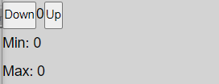
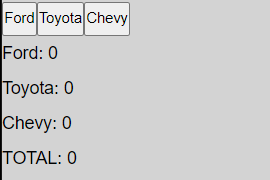
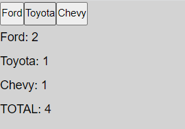
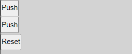

# JavaScript React Intro Assignments 2

All of the examples here are built with the following approach:
- Single React component
- State
- No props
- No style

# Ex. 1: Date Fetcher
Create a React component called `DateFetcher`.  The `DateFetcher` has a state variable that is used to store the UTC date.  When the `DateFetcher` is initially loaded into the browser it displays the following:


When the button is pushed, the current date in UTC format is displayed.  Example:


Place this component in your Main component in your Student directory:

```
export const Main = () => {
  return (
    <DateFetcher />
  )
}
```

Always keep the DevTools console open (Ctl+Shift+I) and remove any errors or warnings.

When you are finished create a PR with the following title: `Ex. 1: Date Fetcher`.

# Ex. 2 Ten Counter
Create a React component called `TenCounter` that displays the number of times a button has been pushed.  When the counter reaches the value of 10, it resets to 0.


Place this component in your Main component in your Student directory:

```
export const Main = () => {
  return (
    <TenCounter />
  )
}
```

Always keep the DevTools console open (Ctl+Shift+I) and remove any errors or warnings.

When you are finished create a PR with the following title: `Ex. 3: Up Down Counter`.

# Ex. 3 Up Down Counter
Create a React component called `UpDownCounter` that increments or decrements the value of the counter.  This component should have one state variable and one button handler function.


Place this component in your Main component in your Student directory:

```
export const Main = () => {
  return (
    <UpDownCounter />
  )
}
```

Always keep the DevTools console open (Ctl+Shift+I) and remove any errors or warnings.

When you are finished create a PR with the following title: `Ex. 3: Up Down Counter`.

# Ex. 4 Min Max Counter
Create a React component called `MinMaxCounter`.  Copy the `UpDownCounter` from the previous example and add Min/Max values:



When component has been loaded into the DOM for the first time all values are reset to 0.

The Max counter stores the highest positive number produced when the up button has been pressed.  The Min counter stores the smallest number produced when the down button has been pressed.


Place this component in your Main component in your Student directory:

```
export const Main = () => {
  return (
    <MinMaxCounter />
  )
}
```

Always keep the DevTools console open (Ctl+Shift+I) and remove any errors or warnings.

When you are finished create a PR with the following title: `Ex. 4: Min Max Counter`.

# Ex. 5 Number Builder
Create a React component called `NumberBuilder`.  The `NumberBuilder` builds a string of numbers that represent how many times the Add Numbers button has been pressed. The Reset button clears the Numbers.

Initial load:


Add Number button pressed 7 times:


Place this component in your Main component in your Student directory:

```
export const Main = () => {
  return (
    <NumberBuilder />
  )
}
```

Always keep the DevTools console open (Ctl+Shift+I) and remove any errors or warnings.

When you are finished create a PR with the following title: `Ex. 5: Number Builder`.

# Ex. 6 Random Number
Create a React component called `RandomNumber`.  When the Generate button is pressed a random number bewteen 0-10 is displayed.


Place this component in your Main component in your Student directory:

```
export const Main = () => {
  return (
    <RandomNumber />
  )
}
```

Always keep the DevTools console open (Ctl+Shift+I) and remove any errors or warnings.

When you are finished create a PR with the following title: `Ex. 6: Random Number`.

# Ex. 7 Car Counter
Create a React component called `CarCounter`.  This component keeps track of the number of times the Ford, Toyota and Chevy button have been pressed.  It also keeps track of the total count.





Place this component in your Main component in your Student directory:

```
export const Main = () => {
  return (
    <CarCounter />
  )
}
```

Always keep the DevTools console open (Ctl+Shift+I) and remove any errors or warnings.

When you are finished create a PR with the following title: `Ex. 7: Car Counter`.

# Ex. 8 Add Calculator
Create a React component called `AddCalculator`.  This component creates a total based on the buttons that have been pushed.


Place this component in your Main component in your Student directory:

```
export const Main = () => {
  return (
    <AddCalculator />
  )
}
```

Initial page load:


Buttons "Add 1" and "Add 2" and "Add 3" have been pushed:


Always keep the DevTools console open (Ctl+Shift+I) and remove any errors or warnings.

When you are finished create a PR with the following title: `Ex. 8: Add Calculator`.

# Ex. 9 Buttons
Create a React component called `Buttons`.  This component changes the text of the buttons from Push to Pushed when a button has been pushed.  The Reset button resets the text of both buttons to "Push".

Initial page load and reset:



Both buttons have been pushed:


Place this component in your Main component in your Student directory:

```
export const Main = () => {
  return (
    <Buttons />
  )
}
```

Always keep the DevTools console open (Ctl+Shift+I) and remove any errors or warnings.

When you are finished create a PR with the following title: `Ex. 9: Buttons`.

# Ex. 10 Timer

Create a React component called `Timer`.  This component reports the number of seconds that have elapsed between button pushes.

Initial page load and reset:


Button pushed:


Button pushed again after 2 seconds.


Place this component in your Main component in your Student directory:

```
export const Main = () => {
  return (
    <Timer />
  )
}
```

Always keep the DevTools console open (Ctl+Shift+I) and remove any errors or warnings.

When you are finished create a PR with the following title: `Ex. 10: Timer`.
